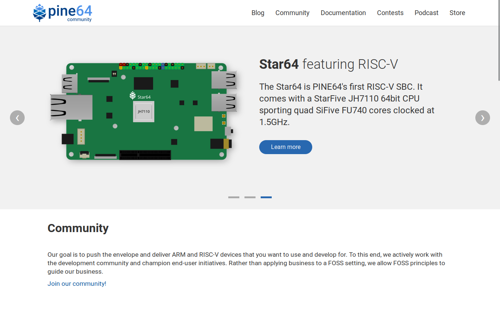

# Welcome to the PINE64.org community website



## Building the website

Install `git` and check out the website repository using the following command:

```sh
git clone https://github.com/pine64/website.git
cd website-main
```

### Get Hugo

Install *Hugo* as explained under https://gohugo.io/installation/.

* Arch Linux: `sudo pacman -S hugo`
* Debian: `sudo apt install hugo`
* Fedora: `sudo dnf install hugo`
* Gentoo: `sudo emerge --ask www-apps/hugo` (SASS/SCSS support not required)
* NixOS: `nix-shell -p hugo` (to temporarily test it in a nix-shell)
* openSUSE: `sudo zypper install hugo`
* Solus: `sudo eopkg install hugo`
* Windows: See [here](https://gohugo.io/installation/windows/)
* MacOS: See [here](https://gohugo.io/installation/macos/)
* BSC: See [here](https://gohugo.io/installation/bsd/)


### Preview the website

The website can be previewed with Hugo using an in-built webserver for development purposes. Hugo will also watch for file changes and automatically rebuild the site and reload the page in your browser. To preview the website, run:

```bash
hugo server
```

Then point your browser to [http://localhost:1313/]()



For further details see [https://gohugo.io/commands/hugo_server/]().


### Generate the html pages (optional)

The html pages can be generated to the *public* folder using:

```bash
hugo
```


## Site structure

```
website-main/
├── archetypes/
│   └── default.md
├── assets/
├── config/_default/
│   └── config.toml [site configuration]
├── content/
│   │── blog/
│   │── community/
│   │── contests/
│   │── documentation/
│   └── podcast/
├── data/
├── layouts/
├── public/ [contains the html files generated with "hugo"]
├── static/
└── themes/pinetheme/
    │── archetypes/
    |   └── default.md
    │── layouts/
    │── static/
    │   │── artwork [background artwork]
    │   │── css [css files]
    │   │── img [static images]
    │   │── js [static javascripts]
    │   │── podcast [podcast episodes]
    │   └── podlove [podcast player]
    └── theme.toml [theme configuration]
```

For an explanation of the folder structure see https://gohugo.io/getting-started/directory-structure/.

## Contributing

To contribute to the website, you can edit the files as listed above. For example to make corrections at blog posts, go to the folder where the blog posts are stored:

`project/content/blog/`

Then open the markdown file (such as `april-update-no-more-unicorns.md`) and edit it. The documentation pages can be edited under `project/content/documentation/`.

Changes to the theme can be made in the following folder:

`project/themes/pinetheme/`

Make sure to test your changes with Hugo's in-built preview:

`hugo server`

## Need help or got questions?

Join the community platforms, we're happy to help!