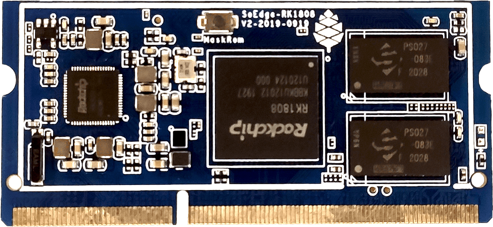

The *SOEDGE* is a 3TOPS compute module that can be paired with the link:/documentation/SOEDGE_Baseboard[SOEDGE Baseboard], the link:/documentation/Clusterboard[Clusterboard] or USB 3.0 and PCIe adapters for development. It can connect to a SBC, such as the ROCKPro64 or a regular PC.

